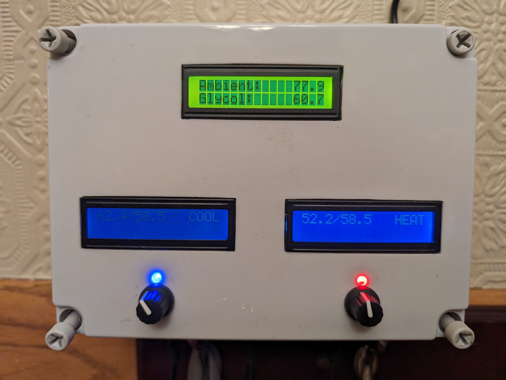
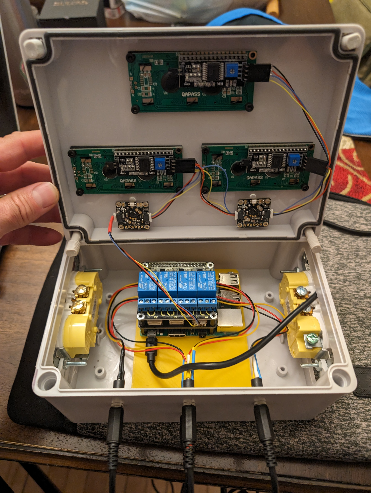

# TiltPiRelay
Temp controller relay which uses DS18B20 temp sensors and Tilt hydrometers to monitor temperature, control power relays and log data at adafruit.io.  This is intended for a temp controller and data logger for beer fermentation.  It can control 2 seperate fermentations and also monitor internal, ambient and glycol temperatures.  It's written as a python script and intended to run on a Raspberry Pi.




## Hardware

### Relay Board
The controller uses an [off the shelf 4-relay Pi HAT](https://www.amazon.com/gp/product/B072XGF4Z3).  The 4 relays allow for 3 states (Heat/Cold/Off) for each of the two monitored channels.

### LCD / Rotary Encoder / LEDs
The [rotary encoder](https://www.adafruit.com/product/4991) used from Adafruit includes a controller and RGB LED which can be accessed by I2C.  The LCD is a HD44780 based 16x2 I2C display.  All the I2C devices can be daisy chained together.  To simplify the wiring, an interposer HAT was created which adds qwiic connectors.

### Temp sensors
There are 5 one-wire-bus temp sensors supported:
  * Channel 1 - Temperature of fermentation 1 (Used for temp control)
  * Channel 2 - Temperature of fermentation 2 (Used for temp control)
  * Ambient - Ambient air temperature (logged and displayed)
  * Glycol - Glycol reserve temperature (logged and displayed)
  * Internal - Internal temperature on the HAT interposer

Each temp sensor is expected to be on it's own bus (GPIO).  This way there is no need to figure out the address of each sensor.  A 3.5mm stereo headset connector is used to make the temperature probes removeable.

### Connector Interposer
An interposer board simplifies connecting the 1-wire bus temp sensors and I2C deices.  Design files:
  * [Schematic](hw/schematic.pdf) PDF
  * KiCAD design files
    * [Project](hhw/Hat.kicad_pro)
    * [Schematic](hw/Hat.kicad_sch)
    * [PCB](h2/Hat.kicad_pcb)

### Assembly
Inside assembly without high voltage connected



## Software

### One time setup
The dependent Python packages need to be available.  One way to do that is with a virtual env:
```
sudo apt-get install python3-dev
python3 -m venv .venv
. ./.venv/bin/activate
pip3 install --upgrade pip setuptools wheel 
pip3 install -r requirements.txt

. ./.venv/bin/activate
CFLAGS="-fcommon"  pip3 install RPi.GPIO
```

### BLE Support
To receive Tilt hydrometer data, you'll need a BLE capable bluetooth controller.  The Tilt hydrometer sends data in repeated BLE advertisements.  As of September 2024, the bleak packaged should receive these correctly.

On older setups, repeated BLE advertisements would not be reported by bleak.  The workaround was to use hcidump, but this required [special configuration](https://github.com/adafruit/Adafruit_Blinka_bleio#support-for-duplicate-advertisement-scanning-on-linux) so that a regular user can run hcidump.  If you don't see any Tilt data coming in, make sure your user has permissions to run hcidump.

### Load w1 busses
The 5 W1 busses need to be started in order so that the script knows which bus is which temp sensor.  This can be done with `w1-setup.sh load` or manuall done with:
```
sudo dtoverlay w1-gpio gpiopin=23 pullup=0  # CTRL-1  (top left)
sudo dtoverlay w1-gpio gpiopin=27 pullup=0  # CTRL-2  (top right)
sudo dtoverlay w1-gpio gpiopin=17 pullup=0  # AMBIENT (top middle)
sudo dtoverlay w1-gpio gpiopin=24 pullup=0  # GLYCOL  (bottom middle)
sudo dtoverlay w1-gpio gpiopin=25 pullup=0  # ONBOARD
```

### Start at boot
A simple systemd service is defined to auto-start at boot.  Install it with:
```
sudo cp tiltpirelay.service /usr/lib/systemd/system/
sudo systemctl enable tiltpirelay
```
